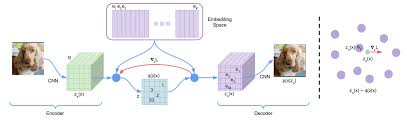
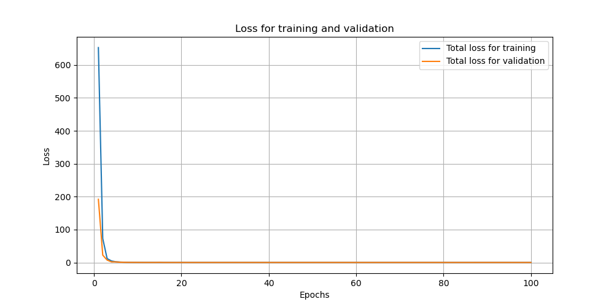
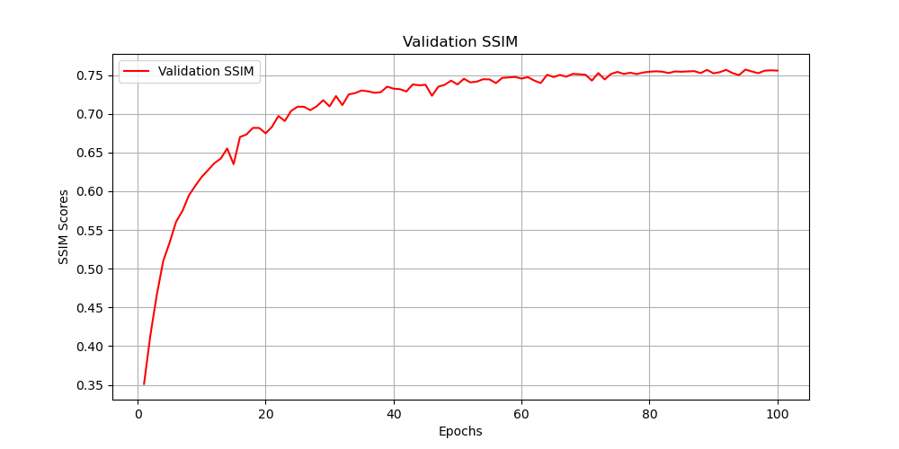
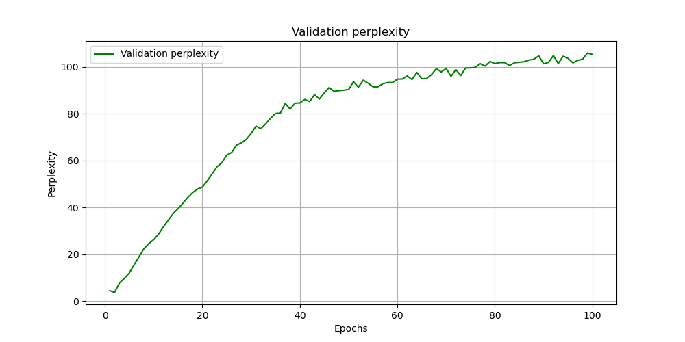
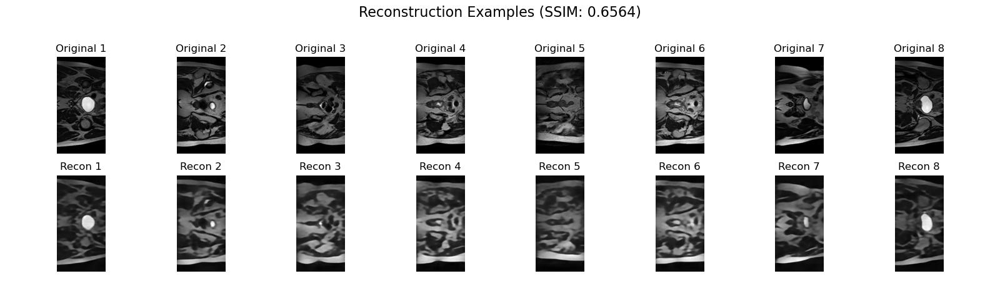
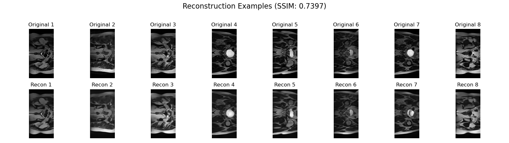
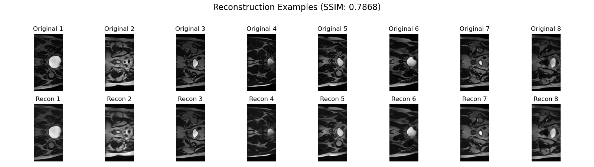
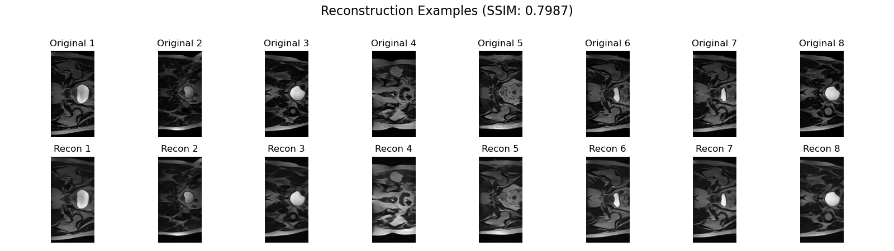
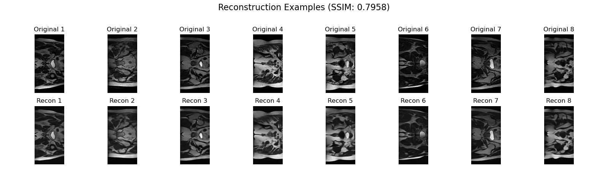

# HipMRI Study on Prostate Cancer Using the Generative Model VQ-VAE

## Project description 
My project aims to train a Vector-Quantised Variational Autoencoder (VQ-VAE) on preprocessed 2D prostate MRI images from the HipMRI prostate cancer study. The goal of this project is to build a VQ-VAE, train it using 2D prostate MRI images, and use the trained VQ-VAE to not only produce reconstructed images with reasonable clarity but also reconstructed images that have a Structured Similarity Index (SSIM) of 0.6 or higher. By producing realistic slice samples, my project provides a valuable tool for exploring prostate cancer imaging and supporting downstream research.    

## Overview 

### How the VQ-VAE works
Vector-Quantised VAEs (VQ-VAEs) build on standard VAEs but replace the continuous latent space with a discrete one [1]. Although traditional VAEs aim to minimise the reconstruction loss between the original and reconstructed images and learn continuous latent representations of the data, they often encounter issues such as posterior collapse [1]. This issue occurs when the model fails to effectively utilise the information during reconstruction, resulting in a simplified latent space [1].

Using a discrete latent space rather than a continuous one enables VQ-VAEs to avoid posterior collapse by generating higher-quality images through vector quantisation, which captures more meaningful representations [2]. Instead of relying on a static Gaussian distribution, which limits the model's capacity to modify its outputs, the design enables the encoder to output discrete codes, allowing it to learn a dynamic prior [2]. This discrete method is suitable for a variety of generative tasks, as it provides greater control over the generated material [2]. 

The architecture of the VQ-VAE is the $ \text{encoder} \Rightarrow \text{vector quantizer} \Rightarrow \text{decoder} $. On each forward pass, the encoder turns the image into a grid of feature vectors [1]. A quantizer then replaces each vector with the nearest code from a small learned dictionary (the codebook), and the decoder turns that grid of codes back into an image [2]. We train by minimising the difference between the output and the input (reconstruction loss) and by keeping the encoder and codebook aligned (the VQ/commitment terms) [2]. In inference, we can either reconstruct an input or generate new images by sampling code indices and decoding them.

The image below describes how a simple VQ-VAE architecture works with the encoder, vector quantizer and decoder. 



Figure. 1. A simple VQ-VAE architecture [3] 

### Obtaining the loss
To optimise the encoder and decoder and ensure high-quality picture reconstructions, the VQ-VAE model employs a loss function comprising three essential components [4].

1. The reconstruction loss [4] 
This measures how close the reconstructed images $\hat{x}$ are to the original images $x$. Reconstruction loss can be calculated using MSE or L1. The equation to calculate the reconstruction loss can be seen here $L_{\text{recon}} = \|x - \hat{x}\|_2$ (or sometimes $\|x - \hat{x}\|_1$). 

2. The VQ loss [4] 
This loss improves the quantisation procedure for improved latent representation by aligning embedding vectors $e$ with the encoder output $z_e(x)$. The VQ Loss can be described by the equation $\mathcal{L}_{\text{vq}} = \|\text{sg}[z_e(x)] - e\|^2$. 

3. The commitment loss [4]
The commitment loss keeps the encoder close to the chosen codes. If the encoder drifts too far from the codebook, quantization gets unstable. The commitment loss nudges the encoder outputs towards the selected code vectors. The commitment loss can be described by this equation $\mathcal{L}_{\text{commit}} = \|z_e(x) - \text{sg}[e]\|^2$. 

Overall, the total loss is a summation of the three losses as seen here $\mathcal{L} = \mathcal{L}_{\text{recon}} + \mathcal{L}_{\text{vq}} + \beta \mathcal{L}_{\text{commit}}$ [4]. 

To conduct the project at hand, I created four Python files. The first Python file that I built was dataset.py. This Python file locates the MRI images on my computer, loads them, converts each one into a simple 2D array that PyTorch can use, performs light cleanup (resize/normalise), and builds the training, validation, and test batches for the other scripts. This process is explained in more detail in the 'Data acquisition and processing' section.

## Data acquisition and processing 

### How the data was acquired 
The dataset for this project can be found within the HipMRI Study for prostate cancer radiotherapy. The dataset consisted of prostate 2D MRI slide data under the 'keras_slide_data_folder.' I used the Rangpur path to download the data. The Rangpur path used was /home/groups/comp3710/HipMRI_Study_open. 

### Where the data is located
Once the dataset was obtained, I saved the data in the ./dataset directory. The data used in this project are the keras_slice_train, keras_slice_validate, and keras_slice_test datasets, which can be found as shown below.
```
./dataset/
├── keras_slices_train/
├── keras_slices_validate/
└── keras_slices_test/
```
The HipMRI dataset comprises 12,660 greyscale 2D MRI images of male patients' pelvises, ranging in size but mostly at 256 x 128 pixels. 

### dataset.py - How the data was processed and made ready for use
To process the data, I load each grayscale slice from NIfTI and cast it to a single-channel float32 tensor. I apply z-score normalisation on each MRI slide independently [5]. To do this normalisation, I subtract the mean of the slice from the pixel intensity and divide this by the standard deviation of the slice [5]. The per-slice z-score normalisation can be described by this equation $x_{\text{norm}} = \frac{x - \mu_{\text{slice}}}{\sigma_{\text{slice}} + \epsilon}$ where $x$ is the pixel intensity, $\mu_{\text{slice}}$ is the mean intensity value across all pixels, $\sigma_{\text{slice}}$ is the standard deviation of the intensity values and $\epsilon$ is a small positive constant to prevent zero division [5]. 

I do not resize any image to keep each sample’s true height and width and avoid blurring thin structures or changing aspect ratio; instead, during batching, I pad each slice with zeros on the right and bottom up to the batch’s maximum height and width so every original pixel remains unchanged and the geometry is preserved.  

The training, validation, and test sets of the dataset have been previously separated, and I loaded these sets using DataLoader. The table below shows how the data was split into training, validation, and test sets. There were 11,460 images in the training set, 660 images in the validation set and 540 images in the test set. Since the data was already pre-defined in non-overlapping train, validation and test folders, data leakage was avoided. In other words, only training was used to train the model.

The second Python file that I built is modules.py. This Python file defines the actual VQ-VAE model. It has three main parts: an encoder that compresses the image, a codebook/quantizer that snaps those features to the nearest code, and a decoder that turns the codes back into an image. It also wires up the forward pass and exposes small helpers for the model's losses/metrics. This process is explained in more detail in the 'Building the VQ-VAE model' section.

## Building the VQ-VAE model
To build my VQ-VAE model, I designed a pipeline that connects the data loader I wrote to an encoder, a vector quantiser, and a decoder, all of which are connected together in the VQVAE class within modules.py. 

### The encoder
The encoder ingests the processed grayscale slices produced by dataset.py and compresses them by a factor of 8 in height and width to form a latent grid. The encoder is built as a sequence of convolutional blocks. Each block applies Conv2d, then BatchNorm2d, and then ReLU. For the downsampling steps, the convolution uses a 3×3 kernel with a stride of 2 and padding of 1, which means the spatial size (height and width) is halved at each stage. Between these stages, I insert residual blocks before activation, allowing information and gradients to flow more easily (residuals prevent gradient diminishing), which helps the network maintain its local structure after every downsample. 

I set the base channel width to 64 for my final model build. I initially tried 32 channels; however, this smaller model underfitted the data, resulting in softer edges, and the SSIM struggled to reach the 0.6 threshold. When I attempted to increase the model's size beyond 64 (for example, to 96 or 128 base channel widths), it became too large, making it harder for the model to converge. Hence, with a base channel width of 64, the encoder produced a latent tensor with a shape of [B, z_dim, H/8, W/8], where z_dim represents the embedding dimensions of the latent features. My model structure generated codebook vectors of length 128.

Hence, for a typical input size of 128 x 256, my encoder produces a latent frid of size 16 x 32. I also experimented with the total downsampling factor. Increasing it to 16 by adding another stride resulted in a two-stage removal of excessive fine detail and reduced SSIM, while reducing it to 4 produced a much larger latent grid, which made vector quantisation noisier and decoding slower. An overall factor of 8 provided the best balance.


### The vector-quantiser 
I built a vector-quantiser in modules.py. After the encoder produces a latent feature map, $z_e$ ([B, 128, H/8, W/8]), I pass it to a vector quantiser that turns those continuous features into discrete codes from a learned dictionary, called the codebook. In my implementation, the codebook is created inside modules.py as a trainable lookup table with 512 entries and 128 dimensions per entry. The codebook is randomly initialised at the start of training and then learned end-to-end along with the rest of the model. 

During the forward pass, each 128-dimensional latent vector at each spatial location is replaced by the nearest 128-dimensional codebook vector. The nearest vector is determined by using the squared (Euclidean) distance, and the quantised result is reshaped back to the latent grid to produce the quantised latent $z_q$. I use the conventional straight-through estimator such that gradients flow in the backward pass as if the quantisation step were the identity. This enables the optimiser to update both the encoder and the codebook weights.

The vector-quantiser adds two training terms that align the encoder’s outputs with the codebook. The codebook loss adjusts the selected code vectors so they move toward the encoder’s outputs at the locations where they were used. In contrast, the commitment loss discourages the encoder from drifting far from its chosen codes. I weighted this commitment term at $\beta$ = 0.25. When I tried $\beta$ = 0.1, the encoder representations drifted, resulting in unstable code assignments. When I tried $\beta$ = 0.5, the connection between the encoder and codebook became too limited, which decreased the use of early codes and did not increase the sharpness of reconstruction. Hence, I used $\beta$ = 0.25

I examined several codebook sizes. Reconstructions with 256 codes tended to seem repetitive because minor anatomical features and delicate textures were often displayed consistently across slices. The picture quality did not increase with 1024 codes, and many of them were not utilised during training; SSIM was comparable to the smaller setting. I decided to use 512 codes with 128-dimensional embeddings because they consistently gave more stable reconstructions and the most dependable SSIM on my validation set.  

### The decoder 
My modules.py also contains the decoder for my model. The decoder reconstructs a full-resolution grayscale slice from the discrete latent code produced by the vector quantiser. It takes $z_q$ and first applies a 1x1 projection to expand the channels to 256. It then performs three upsampling stages, each doubling the spatial size, until the original height and width are restored. Each upsampling stage uses a transposed convolution with a 4×4 kernel, a stride of 2, and padding of 1, ensuring that the geometry scales cleanly by a factor of 2. After the first two upsampling stages, I include a residual block to refine features as resolution increases; these residual units help the network retain fine detail as it reintroduces spatial information. A final 1x1 convolution maps the features to a single output channel (the grayscale image). 

Instead of using nearest-neighbour upsampling and then 3×3 convolutions, I used transposed convolutions, as the transposed convolution route consistently maintained sharper edges and finer anatomical features, which are essential for obtaining a decent SSIM on these slices. I tested the alternative upsampling scheme and found that it produced slightly smoother, but also marginally softer, reconstructions.

### The VQ-VAE 
Modules.py's VQVAE class combines the three previously mentioned elements into a single end-to-end model. To create a continuous latent tensor with form [B, 128, H/8, W/8], the encoder first processes an input slice at runtime. This latent is then sent to the vector-quantiser, which creates the quantised latent z_q, which has the same spatial dimensions as the encoder output, by substituting the closest entry from the learnt codebook for each 128-dimensional latent vector. After consuming z_q, the decoder recreates a single-channel picture with the initial resolution.

The third Python file is train.py. This script trains the model built in predict.py using the datasets from dataset.py. It updates the weights for each epoch, tracks loss and SSIM, displays a progress bar, saves plots, and writes out the best checkpoint (chosen based on validation SSIM).

## Training 

### How train.py works 
The whole VQ-VAE learning and evaluation process is coordinated by train.py. The training, validation, and test data loaders are initially constructed using the dataset.py file. The script then automatically chooses the computing device, instantiating the model as a CUDA GPU if one is available or the CPU otherwise. The VQVAE model is then instantiated ``` VQVAE(in_channels=1, base=64, z_dim=128, n_codes=512, beta=0.25) ``` 

In the train.py script, I define the total loss (as described previously through the combination of the reconstruction loss equation, the VQ loss equation, and the commitment loss equation). Optimisation then proceeds with the Adam optimiser at a specified learning rate. When optimisation is occurring, for every mini-batch, the train.py script computes the total loss and runs backpropagation to obtain gradients. Adam updates each parameter with an adaptive step computed from exponentially weighted averages of past gradients (first moment) and of their squared values (second moment), producing parameter-wise step sizes scaled by the chosen learning rate.

Training is organised into epochs, where an epoch is one complete pass through the entire training set. At the start of each epoch, the DataLoader shuffles the samples and splits them into mini-batches. At the beginning of each epoch, the DataLoader shuffles the samples and splits them into mini-batches. Within each epoch, each mini-batch undergoes the compute-loss step, followed by backpropagation, and then proceeds to the Adam update cycle described above. As a result, the parameters take many small steps as the model processes all training examples once. 

When the epoch ends, the script switches to evaluation mode and runs over the validation set to compute validation loss and validation SSIM. The SSIM measures the perceived structural similarity between two images, comparing local luminance, contrast, and pattern similarity. The SSIM score is a value between 0 and 1, where a higher score indicates that the reconstructed images are more structurally similar to the original images compared to a lower score. If the current model achieves a higher validation SSIM than any previous epoch, its weights are saved as the best checkpoint. 

Apart from SSIM, train.py also provides perplexity, which is a codebook used for diagnostics. The train.py script highlights how widely the model is utilising the available codes after quantisation and examines which code indices were selected throughout the latent grid. A very low perplexity indicates that the model is collapsing onto a small set of codes. If the model is functioning well, then code usage will usually tend to widen in the early epochs and then stabilise as training converges. Perplexity is logged per epoch alongside loss and SSIM, but is used purely just for monitoring the model and is not part of the optimisation.  

### Hyperparameters used in training 
- **Epochs: 100**
I initially tried only 30 epochs and then progressed to 80 epochs. I then tried 100 epochs and then 120 epochs. With 30 epochs, it was evident that SSIM would not stabilise anytime soon. With 80 epochs, SSIM sometimes stabilised just after training stopped. With 120 epochs, SSIM was already very stable; hence, I decided to use 100 epochs with early stopping and a patience of 8, anticipating that the best SSIM would occur somewhere between 80 and 100 epochs. 

- **Batch size: 32**
I initially tried a batch size of 16, but decided against this as it produced noisier SSIM curves and slower convergence. I then tried a batch size of 64; however, this batch size stressed the computational power without making any gain to the reconstructed images. Hence, I settled for a batch size of 32 as it produced stable updates. 

- **Optimiser: Adam**
After incorporating Adam, I then tried to incorporate AdamW, which is the Adam optimiser with weights, to see if it would give improved results. AdamW did not improve SSIM for this project and, in fact, slowed the early learning phase. So I stayed with using Adam as the optimiser. 

- **Learning rate (Adam): $3 \times 10^{-4}$**
I also tried learning rates such as $1 \times 10^{-4}$ and $1 \times 10^{-3}$. At $1 \times 10^{-4}$, the model converged more slowly and at $1 \times 10^{-3}$, the loss occasionally spiked and early validation SSIM degraded. Hence, $3 \times 10^{-4}$ provided the best balance between the two.

- **Dataloader worker: 2**
I first tried a worker of 0; however, using 0 under-utilised I/O. I then tried a dataloader worker of 4; however, this value increased the time spent creating and coordinating extra worker processes. Hence, I found a dataloader worker value of 2 to be best. 

Each epoch ends with the printing of the SSIM scores and the average training and validation losses. This offers an overview of the model's performance throughout time. Train.py then saves the plot as an image after plotting the SSIM scores and training and validation losses throughout the epochs. This makes it easier to see how the model performs as training progresses.

The following plots illustrate the performance of my trained model.   


Graph. 1. The train and validation loss versus epoch number 

Graph. 1 shows total loss (reconstruction loss with VQ terms) for training (blue) and validation (orange) over 100 epochs. Both curves start high and drop steeply in the first few epochs, which means the model learns the basic reconstruction mapping very quickly at the chosen learning rate. At the 100th  epoch, it can be seen that the validation loss has dropped to 0.237.  


Graph. 2. Validation SSIM versus epoch number 

Graph. 2. shows the validation SSIM improving over training. The score climbs rapidly from around 0.35 at epoch 1 to greater than 0.60 by roughly 10–15 epochs. After that, increases in the SSIM score are gradual with small, normal fluctuations, and the curve starts to plateau around 0.74 to 0.76 by around 50–60 epochs. The absence of a downward drift suggests that there is no obvious overfitting. The plateauing curve in the graph further emphasises that additional epochs of more than 100 are not necessary, and SSIM is likely to stay within the 0.74 to 0.76 range regardless.


Graph. 3. Validation perplexity versus epoch number 

Graph. 3 shows how validation perplexity changes as the epoch number increases. It begins very low (around 5) in the first epoch and then increases through around 40 to 60 epochs as the encoder and codebook co-adapt. This indicates that code use is becoming more diverse rather than collapsing. After epoch 60, the curve levels off at around 95 to 105 with small fluctuations, which suggests code usage has stabilised. The plateau timing aligns with the SSIM plateau, meaning that once the model has learned a useful set of codes, continued quality improvement occurs only marginally.

From my observations, I found that epoch 95 produced the best SSIM of 0.7571. Therefore, the model created at this epoch was saved as the best model and used to predict the reconstructed images using the test set in predict.py.  

## Predictions - producing reconstructed images
The last Python file produced for the project was predict.py. The predict.py script is the driver script. It loads a saved checkpoint (the best model that delivers the highest SSIM), makes reconstructions of test images and prints the average SSIM. All example images are saved in a predictions/ folder.

Below are some examples of reconstructed images (bottom) versus the original images (top) at different epochs.  


Figure. 2. Eight examples of original images vesus the reconstructed images for 10 epochs


Figure. 3. Eight examples of original images vesus the reconstructed images for 30 epochs


Figure. 4. Eight examples of original images vesus the reconstructed images for 50 epochs


Figure. 5. Eight examples of original images vesus the reconstructed images for 70 epochs


Figure. 6. Eight examples of original images vesus the reconstructed images for the best model

Through the images, it can be seen that reconstruction quality improves gradually from early training to mid-training and then starts to saturate. At epoch 10, low-frequency blur is the primary feature that shows up in the outputs. Large, bright areas are reproduced accurately, but the edges are soft, and the internal textures are washed out. By epoch 30, the model has clearer boundaries and more consistent contrast. The dark and bright areas are in the right places, but the fine details are still blurred. At epoch 50, the thin, high-contrast structures are better defined, and the shading artefacts along the edges get smaller. This shows that the encoder-codebook-decoder pipeline is modelling both global anatomy and mid-scale texture. The epoch 70 panel is the best in terms of quality and gives the highest test SSIM of all the runs. The outlines of the organs are clear, the small, bright foci are in the right places, and the backgrounds are smooth without excessive blur. This is the point where your validation SSIM curve has mostly levelled off. The checkpoint that validation SSIM chose as the "best" at epoch 95 looks very similar overall, but it is slightly smoother in areas with high contrast. This is why the test SSIM is slightly lower than that of the 70-epoch model (the latter, having trained for a longer period, probably tuned more closely to the validation distribution and traded some sharpness for stability).

Overall, the images show a rapid increase in reconstruction quality as the epoch number increases, with convergence occurring around 70 epochs. Only small changes in appearance can be seen after 70 epochs. Hence, the 70-epoch reconstructions work best on the held-out test set.

## Usage 

Where all the files can be found can be seen through the tree below:
```
s4858817_VQVAE/
├── dataset/                         
│   ├── keras_slices_train/
│   ├── keras_slices_validate/
│   └── keras_slices_test/
├── readme_images/                   
│   ├── VQVAE_arch.jpeg
│   ├── loss_plot.png
│   ├── validation_ssim_plot.png
│   ├── validation_perplexity_plot.png
│   ├── prediction_reconstruction_examples_10.png
│   ├── prediction_reconstruction_examples_30.png
│   ├── prediction_reconstruction_examples_50.png
│   ├── prediction_reconstruction_examples_70.png
│   └── prediction_reconstruction_examples_best.png
├── .gitignore
├── environment.yml                  
├── dataset.py                    
├── modules.py                       
├── train.py                        
├── predict.py                      
├── README.md   
```
### Setting up the Conda environment 
I created a conda environment in environment.yml to enable users to run the Python files exactly as reported and reproduce the results. Users can set up the Conda environment using these commands:

To obtain the environment from the repo root, type this command:
```conda env create -f environment.yml``` 

To activate the environment, type this command:
```conda activate comp3710```

If the user makes edits to the environment, they can update it using this command:
```conda env update -f environment.yml --prune```

If the user wants to re-export a clean spec of the original environment that they installed they can type this command:
```conda env export --from-history > environment.yml```

### Running the python files and reproducability
To train the VQ-VAE model, run train.py. This script builds the loaders from dataset.py, constructs the model from modules.py, and saves logs/checkpoints/plots to --save_dir. 

To run train.py, type this command:
```
python train.py \
  --repo_root . \
  --save_dir results/exp1 \
  --epochs 100 \
  --batch_size 32 \
  --lr 3e-4 \
  --num_workers 2 \
  --model_base_channels 64 \
  --z_dim 128 \
  --n_codes 512
  ```
In the command, the hyperparameters can be adjusted accordingly. Outputs be saved in results/exp1 and will include best_model.pth, a CSV of metrics, and the loss/SSIM/perplexity plots.

To evaluate and make reconstructions/generations, run predict.py. This script loads the trained checkpoint, rebuilds the VQ-VAE with the specified hyperparameters (which must match those used during training), reads data from --input_data_dir, reports the mean SSIM on a test batch, and saves example images to --output_dir.

To run the predict.py script, run this command:
```
python predict.py \
  --model_path results/exp1/best_model.pth \
  --input_data_dir ./dataset \
  --output_dir predictions \
  --num_examples 8 \
  --device cuda \
  --model_base_channels 64 \
  --z_dim 128 \
  --n_codes 512
```
In the command, the hyperparameters can be adjusted accordingly. Once this command has run, the terminal will print the latent grid size and mean SSIM. Files saved to --output_dir include the prediction_reconstruction_examples.png, which show the original versus reconstructed images. 

The user must run train.py before running predict.py.

### Dependencies
- Python 3.12.11

- PyTorch 2.4.1

- TorchVision 0.19.1

- TorchMetrics 1.4.2

- NumPy 1.26.4

- NiBabel 5.3.0

- Matplotlib 3.8.4

- tqdm 4.66.5

- pandas 2.2.2

The user should run the environment.yml file, which will automatically upload the dependencies. 

## Limitations 
Some of the limitations of my VQ-VAE model include:

- Not suitable for 3D slices: The VQ-VAE was trained on individual 2D slices, not 3D volumes. Hence, my model cannot be used for 3D slices as it cannot ensure that the slices are consistent or obtain the anatomical context that spans several slices. 

- Intensity normalisation choice: 
Per-slice z-score normalisation means that each 2D slice is rescaled to have a mean of zero and a variance of one. This makes optimisation more stable because inputs come in on a consistent numerical scale, gradients behave better, and a single learning rate works reliably. The downside is that it eliminates the differences in absolute intensity and global contrast between scans, which could be due to variations in scanner settings or tissue properties. This means that the model cannot use intensity cues from different subjects or scanners.

- Batching with padding:
Images are never resized; instead, smaller slices are padded with zeros on the right and bottom to make rectangular batches. This maintains the shape but alters the effective content area, potentially affecting and biasing the statistics and edge responses of BatchNorm near the padded borders.

- Small generalisation gap:
The epoch with the best validation SSIM (epoch 95) did not have the best test SSIM (the 70-epoch model was a little better). This shows that the validation split and early-stopping criterion are not very sensitive.

- Limited codebook capacity:
With 512 codes and 128-dimension embeddings, rare or very small structures may still be mapped to generic tokens, which makes it less accurate in edge cases.

## Future works 
- In the future, I would like to use my VQ-VAE model to produce generated images. To do this, I will need to create a learned prior over the codes. I will train an autoregressive prior, like PixelCNN or Transformer, or a diffusion model over the 16×32 code. 

- In the future, I would also like to train my model such that it can be used for 3D slices as well. 

- I would also like to conduct hyperparameter tuning to see if I can get my validation SSIM score to be greater than 0.8. 

## Conclusion 
To conclude, I designed, trained, and tested a VQ-VAE for 2D prostate MRI slices from the HipMRI study as part of this project. I built a complete, reproducible pipeline that included data loading, per-slice z-score normalisation, an encoder–vector-quantiser–decoder architecture, and a well-instrumented training loop. The model met and exceeded the stated target of SSIM ≥ 0.6, achieving a best validation SSIM of 0.7571. My model also produces 'reasonably clear' reconstructed images. Even though training for more than 70 epochs sometimes raised the validation score (reaching its best at epoch 95), the epoch-70 model had a slightly higher test SSIM, indicating that the returns were decreasing and a small generalisation gap was present after the plateau. In general, the system captures the basic structure of prostate MRI slices, provides a baseline that can be repeated, and exceeds the 0.6 SSIM target, setting the stage for future work.  

## References 
[1] [Mentzer, F., Minnen, D., Agustsson, E., & Tschannen, M. (2023).        Finite scalar quantization: Vq-vae made simple. arXiv preprint arXiv:2309.15505.](https://arxiv.org/abs/2309.15505)

[2] [Rodriguez, A., & Kokalj-Filipovic, S. (2024). VQalAttent: a Transparent Speech Generation Pipeline based on Transformer-learned VQ-VAE Latent Space. arXiv preprint arXiv:2411.14642.](https://arxiv.org/abs/2411.14642) 

[3] [Li, Y. (2022, November 1). Deep image synthesis through VQVAE and VQGAN. Medium.](https://medium.com/@yl4886/deep-image-synthesis-through-vqvae-and-vqgan-e90fe9a27812) 

[4] [Yadav, S. (2019, September 1). Understanding vector quantized variational autoencoders (VQ-VAE). Medium.](https://shashank7-iitd.medium.com/understanding-vector-quantized-variational-autoencoders-vq-vae-323d710a888a)

[5] [Reinhold, J. C., Dewey, B. E., Carass, A., & Prince, J. L. (2019). Evaluating the impact of intensity normalization on MR image synthesis.](https://pmc.ncbi.nlm.nih.gov/articles/PMC6758567/)


